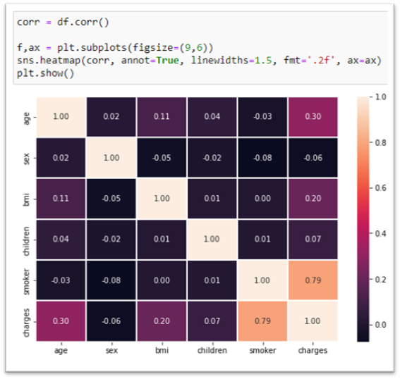
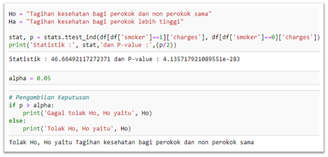
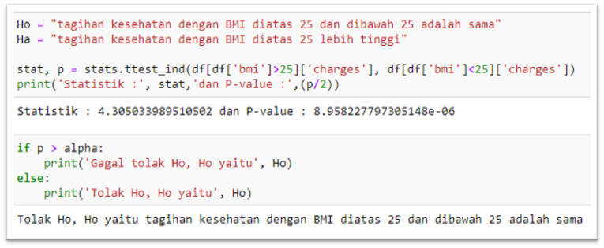
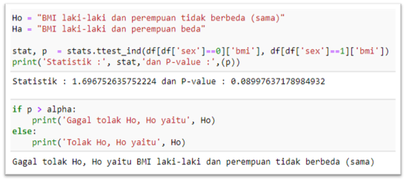
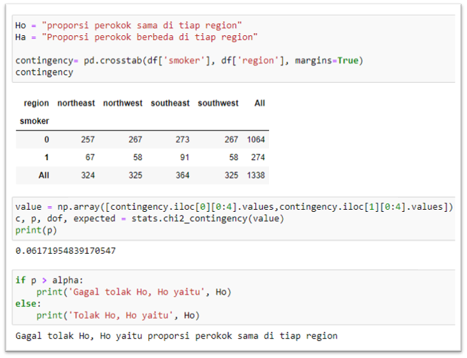

# Analisis Asuransi Kesehatan

---

Asuransi kesehatan adalah salah satu hal yang patut diperhatikan karena bersangkutan dengan kebutuhan perencanaan masa depan. Pengguna asuransi kesehatan diwajibkan untuk membayar besaran uang secara rutin (premi) kepada pihak perusahaan asuransi. Premi tersebut diolah oleh perusahaan asuransi untuk membayarkan tagihan kesehatan pengguna yang tertanggung. Penentuan nilai premi menjadi tantangan tersendiri bagi pihak asuransi mengingat ada banyak faktor yang dapat mempengaruhi & meningkatkan profil resiko pengguna.

Melalui project ini, dilakukan analisa variable-variabel yang memiliki hubungan dengan tagihan kesehatan yang diterima oleh setiap pengguna.

**1. Descriptive Statistics Analysis**
- Dataset yang digunakan, diambil dari 1.338 orang yang memiliki rata rata umur 39 tahun. Rata-rata nilai BMI dari yang merokok adalah 31, ini menunjukkan rata-rata orang yang merokok memiliki bmi overweight, bahkan mendekati obesity dimana nilai tersebut jauh dari rentang normal (19-25).
- Sebaran tagihan kesehatan antara perokok dan non perokok tidaklah sama, dimana sebaran tagihan perokok ternyata lebih besar daripada non perokok. Selanjutnya kedua sebaran tersebut memiliki varian yang besar, hal ini menunjukkan bahwa angka-angka yang ada di dalam tagihan kesehatan baik perokok maupun non perokok jauh dari rata-rata.
- Rata-rata umur perempuan dan laki-laki yang merokok tidak sama, tetapi rata-rata dari keduanya tidak jauh berbeda karena hanya memiliki selisih 1 tahun. Untuk rata-rata umur perempuan yang merokok adalah 39 tahun sedangkan untuk rata-rata umur laki-laki yang merokok adalah 38 tahun.
- Rata-rata tagihan kesehatan bagi perokok memiliki biaya sebesar $32,050 sedangkan untuk tagihan kesehatan bagi non perokok sebesar $8.434. Hal tersebut membuktikan bahwa rata-rata tagihan kesehatan bagi perokok lebih tinggi dibandingkan non perokok.
- Maksimum BMI dari seorang perempuan memiliki nilai 48.07 sedangkan maksimum BMI dari seorang laki-laki memiliki nilai 53.13. Hal ini menunjukkan seorang laki-laki memiliki BMI lebih tinggi daripada perempuan.
- Seorang perokok memiliki maksimum BMI 52.58 sedangkan non perokok memiliki maksimum BMI 53.13. Ini menunjukkan  seorang non perokok memiliki BMI lebih tinggi daripada perokok.

**2. Categorical Variables Analysis**
- Perempuan memiliki tagihan kesehatan paling tinggi dibandingkan laki-laki. Hal ini dikarenakan proporsi non perokok lebih tinggi dibandingkan perokok.
- Peluang seseorang adalah perempuan diketahui dia adalah perokokyaitu 0.41 sedangkan peluang seseorang adalah laki-laki diketahui dia adalah perokok yaitu 0.58. Hal ini menunjukkan  bahwa jika diketahui ada seseorang perokok maka peluang bahwa seseorang tersebut adalah laki-laki lebih tinggi daripada perempuan.

**3. Continuous Variables Analysis**
- Peluang seseorang tagihan kesehatannya diatas 16.7k diketahui bahwa dia adalah seorang perokok adalah 0.92.
- Lebih mungkin terjadi seorang perokok dengan BMI diatas 25 mendapatkan tagihan kesehatan diatas 16.7k daripada seseorang non perokok dengan BMI diatas 25.

**4. Variables Correlation**

**5. Hypothesis Testing**
- Tagihan kesehatan perokok lebih tinggi daripada tagihan kesehatan non perokok.

- Tagihan kesehatan dengan BMI diatas 25 lebih tinggi daripada tagihan kesehatan dengan BMI dibawah 25.

- BMI dari laki-laki dan perempuan sama/tidak berbeda.

- Proporsi perokok sama di tiap region.

